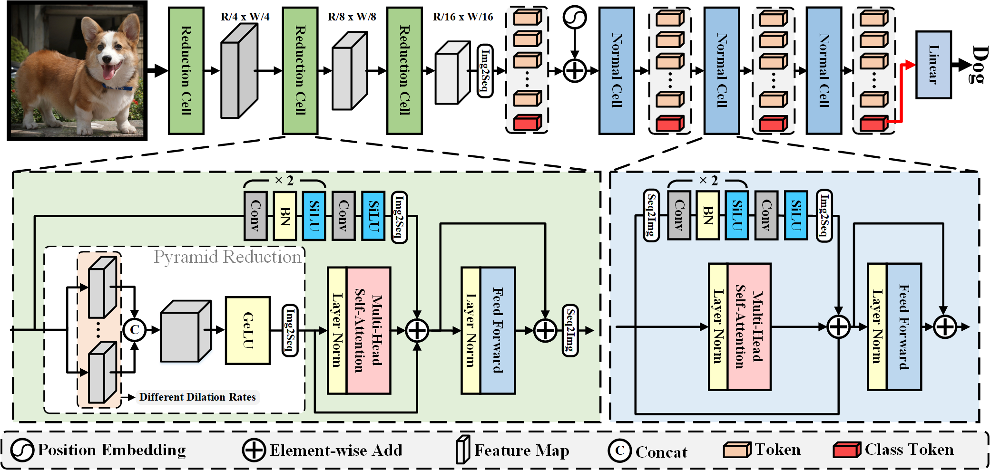

<h1 align="left">ViTAE: Vision Transformer Advanced by Exploring Intrinsic Inductive Bias </h1> 

<p align="center">
  <a href="#Updates">Updates</a> |
  <a href="#introduction">Introduction</a> |
  <a href="#Usage">Usage</a> |
  <a href="#results">Results&Pretrained Models</a> |
  <a href="#statement">Statement</a> |
</p>

## Current applications

> **Image Classification**: Please see <a href="https://github.com/ViTAE-Transformer/ViTAE-Transformer/tree/main/Image-Classification">ViTAE-Transformer for image classification</a>;

> **Object Detection**: Please see <a href="https://github.com/ViTAE-Transformer/ViTAE-Transformer/tree/main/Object-Detection">ViTAE-Transformer for object detection</a>;

> **Sementic Segmentation**: Please see <a href="https://github.com/ViTAE-Transformer/ViTAE-Transformer/tree/main/Semantic-Segmentation">ViTAE-Transformer for semantic segmentation</a>;

> **Animal Pose Estimation**: Please see <a href="#Usage">Usage</a> for a quick start;

> **Matting**: Please see <a href="https://github.com/ViTAE-Transformer/ViTAE-Transformer-Matting">ViTAE-Transformer for matting</a>;

> **Remote Sensing**: Please see <a href="https://github.com/ViTAE-Transformer/ViTAE-Transformer-Remote-Sensing">ViTAE-Transformer for Remote Sensing</a>;


## Updates
***24/03/2022***
Initial code release for ViTAEv2 on Animal Pose Estimation. The code is built upon [mmpose](https://github.com/open-mmlab/mmpose), thanks for their amazing work!

## Introduction

<p align="left">This repository contains the code, models, and logs demonstrated in <a href="https://arxiv.org/abs/2202.10108">ViTAEv2: Vision Transformer Advanced by Exploring Inductive Bias for Image Recognition and Beyond</a>. It contains several reduction cells and normal cells to introduce scale-invariance and locality into vision transformers. Compared to the first version, we stack the two cells in a multi-stage manner and explore the benefits of another inductive bias, i.e., window-based attentions without shifts for a better trade-off between speed, memory footprint, and performance.


<figcaption align = "center"><b>Fig.1 - The details of Reduction Cell and Normal Cell.</b></figcaption>


<figcaption align = "center"><b>Fig.2 - The illustration of ViTAEv2's design.</b></figcaption>


## Usage

### Install

Here we provide the example of training models with the AP-10k dataset and ViTAEv2-S. We thanks the help of mmpose project.

- Clone this repo:

```bash
git clone https://github.com/ViTAE-Transformer/ViTAE-Transformer.git
cd ViTAE-Transformer/Animal-Pose-Estimation
```

- Create a conda virtual environment and activate it:

```bash
conda create -n vitae python=3.7 -y
conda activate vitae
```

```bash
conda install pytorch==1.8.1 torchvision==0.9.1 cudatoolkit=10.2 -c pytorch -c conda-forge
```

- Install `timm==0.3.4`:

```bash
pip install timm==0.3.4
```

- Install `mmcv-full==1.3.9`

```bash
cd ../..
git clone https://github.com/open-mmlab/mmcv.git
cd mmcv
git checkout v1.3.9
MMCV_WITH_OPS=1 pip install -e .
```

- Install this repo

```bash
cd ../ViTAE-Transformer/Animal-Pose-Estimation
pip install -v -e .
```

- Install other requirements:

```bash
pip install pyyaml ipdb
```

### Data Prepare
We use AP10K dataset, you can download it from https://github.com/AlexTheBad/AP-10K. The file structure should look like:
  ```bash
  $ tree data
  data
  ├── ap10k
  │   ├── annotations
        │   │── ap10k-train-split1.json
        │   |── ap10k-train-split2.json
        │   |── ap10k-train-split3.json
        │   │── ap10k-val-split1.json
        │   |── ap10k-val-split2.json
        │   |── ap10k-val-split3.json
        │   |── ap10k-test-split1.json
        │   |── ap10k-test-split2.json
        │   |── ap10k-test-split3.json
  │   ├── data
  │   │   ├── 000000000001.jpg
  │   │   └── ...
  ```

### Evaluation

The pretrained models can be downloaded from [ViTAEv2-S-AP10K](https://drive.google.com/drive/folders/1GJwZojaJerYzibn5rOlDGFxkISX6OXpk?usp=sharing).

Then, the evaluation can be conducted as 

```bash
python tools/test.py configs/animal/2d_kpt_sview_rgb_img/topdown_heatmap/ap10k/vitae_ap10k_256x256.py <POSE_CKPT_PATH>
```

### Training

To train the ViTAEv2-S model on the AP-10K dataset, please run

```bash
bash tools/dist_train.sh configs/animal/2d_kpt_sview_rgb_img/topdown_heatmap/ap10k/vitae_ap10k_256x256.py <GPU_NUM> --cfg-options model.pretrained=<PRETRAINED_MODEL_PATH>
```

- The trained model file will be saved under the ```work_dirs``` folder;
- The weights for the pretrained backbone models can be downloaded from [ViTAE for Image Classification](https://github.com/ViTAE-Transformer/ViTAE-Transformer-Image-Classification). 

## Results

## Main Results on the AP10K dataset
| name | resolution | mAP | Pretrained | 
| :---: | :---: | :---: | :---: |
| ResNet-50 | 256x256 | 68.1 | N/A |
| Swin-T | 224x224 | 68.9 | N/A |
| ViTAEv2-S | 224x224 | 71.8 | [Weight&Log](https://drive.google.com/drive/folders/1GJwZojaJerYzibn5rOlDGFxkISX6OXpk?usp=sharing) |

## Statement
This project is for research purpose only. For any other questions please contact [yufei.xu at outlook.com](mailto:yufei.xu@outlook.com) [qmzhangzz at hotmail.com](mailto:qmzhangzz@hotmail.com) .

## Citing ViTAE and ViTAEv2
```
@article{xu2021vitae,
  title={Vitae: Vision transformer advanced by exploring intrinsic inductive bias},
  author={Xu, Yufei and Zhang, Qiming and Zhang, Jing and Tao, Dacheng},
  journal={Advances in Neural Information Processing Systems},
  volume={34},
  year={2021}
}
@article{zhang2022vitaev2,
  title={ViTAEv2: Vision Transformer Advanced by Exploring Inductive Bias for Image Recognition and Beyond},
  author={Zhang, Qiming and Xu, Yufei and Zhang, Jing and Tao, Dacheng},
  journal={arXiv preprint arXiv:2202.10108},
  year={2022}
}
```

## Other Links

> **Image Classification**: See [ViTAE for Image Classification](https://github.com/ViTAE-Transformer/ViTAE-Transformer/tree/main/Animal-Pose-Estimation)

> **Object Detection**: See [ViTAE for Object Detection](https://github.com/ViTAE-Transformer/ViTAE-Transformer/tree/main/Object-Detection).

> **Semantic Segmentation**: See [ViTAE for Semantic Segmentation](https://github.com/ViTAE-Transformer/ViTAE-Transformer/tree/main/Semantic-Segmentation).

> **Animal Pose Estimation**: See [ViTAE for Animal Pose Estimation](https://github.com/ViTAE-Transformer/ViTAE-Transformer/tree/main/Animal-Pose-Estimation).

> **Matting**: See [ViTAE for Matting](https://github.com/ViTAE-Transformer/ViTAE-Transformer-Matting).

> **Remote Sensing**: See [ViTAE for Remote Sensing](https://github.com/ViTAE-Transformer/ViTAE-Transformer-Remote-Sensing).
